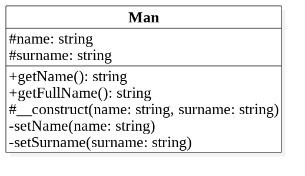
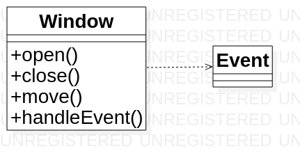

## Диаграммы классов

---

@snap[north]
@size[1em](Унифицированный язык моделирования)
@snapend

@snap[span-60 auto-margin]

@snapend

---
@snap[north]
@size[1.25em](Группы диаграмм)
@snapend

@snap[west span-50 auto-margin] 
  @ul[split-screen-list](false)
  @size[1em](Статические диаграммы)
  - классов
  - объектов
  - компонентов
  - развертывания
@ulend
@snapend

@snap[east span-50 auto-margin]
  @ul[split-screen-list](false)
  @size[1em](Динамическеие диаграммы)
  - деятельности
  - сценариев
  - взаимодействия 
  - состояний
@ulend
@snapend

---

@snap[north]
@size[1em](Диаграммы классов (Class Model))
@snapend

@snap[span-60 auto-margin]

@snapend

+++

@snap[north]
@size[1.25em](Представление классов)
@snapend

@snap[span-100 auto-margin] 

@snapend

+++

@snap[north]
@size[1.25em](Генерация кода класса)
@snapend

```php
class Man
{
	/**
	 * @var string
	 */
	protected $name;
	/**
	 * @var string
	 */
	protected $surname;
	/**
	 * @return string
	 */
	public function getName():string
	{
		// TODO: implement here
		return "";
	}
	/**
	 * @return string
	 */
	public function getFullName():string
	{
		// TODO: implement here
		return "";
	}
	/**
	 * @param string $name
	 * @param string $surname
	 */
	protected function __construct(string $name, string $surname):void
	{
		// TODO: implement here
	}
	/**
	 * @param string $name
	 */
	private function setName(string $name):void
	{
		// TODO: implement here
	}
	/**
	 * @param string $surname
	 */
	private function setSurname(string $surname):void
	{
		// TODO: implement here
	}
}
```
+++

@snap[north]
@size[1.25em](Одиночка)
@snapend

@snap[span-100 auto-margin] 

@snapend

---

@snap[north]
@size[1em](Связи или отношения)
@snapend

@snap[span-100 auto-margin]

@snapend

+++

@snap[north]
@size[1.25em](Базовые отношения)
@snapend

@snap[span-100]
  @ul[split-screen-list](false)
  - отношение зависимости
  - отношение ассоциации
  - отношение агрегации
  - отношение обобщения
@ulend
@snapend

+++

@snap[north]
    @div[split-screen-list](false)
	Отношение зависимости
	(dependency relationship)
    @divend
@snapend

@snap[span-100 auto-margin]

@snapend

+++

@snap[north]
@size[1em]Отношение ассоциации (association relationship)
@snapend

@snap[span-100 auto-margin]

@snapend

+++

@snap[north]
@size[1em]Агрегация (aggregation relationship)
@snapend

@snap[span-100 auto-margin]

@snapend

+++

@snap[north]
@size[1em]Обобщение (generalization relationship)
@snapend

@snap[span-100 auto-margin]

@snapend

+++

@snap[north]
@size[1em]Отношение реализации (realization relationship)
@snapend

@snap[span-100 auto-margin]

@snapend

+++

@snap[north]
@size[1.25em]Обобщение отношений
@snapend

@snap[west span-50 auto-margin] 
  
@snapend

@snap[east span-50 auto-margin]
  
@snapend

---
