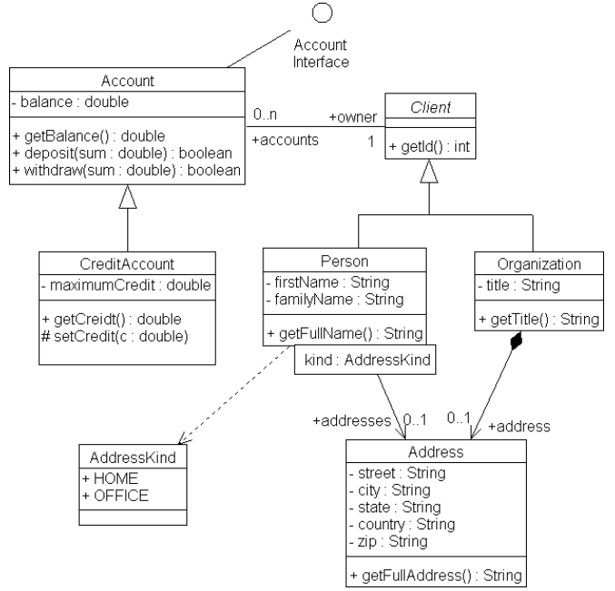

## Диаграммы классов

---

@snap[north]
@size[1em](Унифицированный язык моделирования)
@snapend

@snap[span-60 auto-margin]

@snapend

---
@snap[north]
@size[1.25em](Группы диаграмм)
@snapend

@snap[west span-50 auto-margin] 
  @ul[split-screen-list](false)
  @size[1em](Статические диаграммы)
  - классов
  - объектов
  - компонентов
  - развертывания
@ulend
@snapend

@snap[east span-50 auto-margin]
  @ul[split-screen-list](false)
  @size[1em](Динамическеие диаграммы)
  - деятельности
  - сценариев
  - взаимодействия 
  - состояний
@ulend
@snapend

---

@snap[north]
@size[1em](Диаграммы классов (Class Model))
@snapend

@snap[span-60 auto-margin]

@snapend

+++

---
