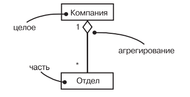
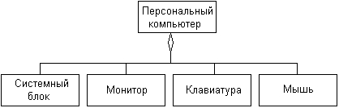
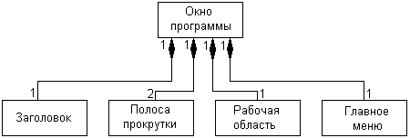
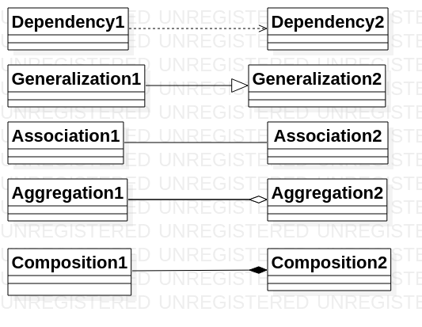
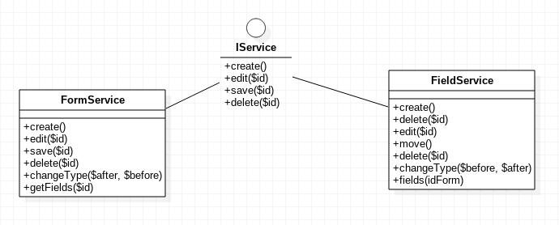

## Объектное моделирование

---

@snap[north]
    @div[split-screen-list](false)
	UML
	@size[0.8em](унифицированный язык моделирования)
    @divend
@snapend

@snap[span-50 auto-margin]

@snapend

---
@snap[north]
@size[1.25em](Группы диаграмм)
@snapend

@snap[west span-50 auto-margin] 
  @ul[split-screen-list](false)
  @size[1em](Статические диаграммы)
  - классов
  - объектов
  - компонентов
  - развертывания
@ulend
@snapend

@snap[east span-50 auto-margin]
  @ul[split-screen-list](false)
  @size[1em](Динамические диаграммы)
  - деятельности
  - сценариев
  - взаимодействия 
  - состояний
@ulend
@snapend

---

@snap[north]
@size[1em](Диаграммы классов (Class Model))
@snapend

@snap[span-60 auto-margin]

@snapend

+++

@snap[north]
@size[1em](Диаграммы классов)
@snapend

@snap[span-100 auto-margin]
  @ul[split-screen-list](false)
  -  классы
  -  интерфейсы
  -  связи или отношения
@ulend
@snapend

+++

@snap[north]
@size[1.25em](Представление классов)
@snapend

@snap[span-100 auto-margin] 

@snapend

+++

@snap[north]
@size[1.25em](Генерация кода класса)
@snapend

```php
class Man
{
	/**
	 * @var string
	 */
	protected $name;
	/**
	 * @var string
	 */
	protected $surname;
	/**
	 * @return string
	 */
	public function getName():string
	{
		// TODO: implement here
		return "";
	}
	/**
	 * @return string
	 */
	public function getFullName():string
	{
		// TODO: implement here
		return "";
	}
	/**
	 * @param string $name
	 * @param string $surname
	 */
	protected function __construct(string $name, string $surname):void
	{
		// TODO: implement here
	}
	/**
	 * @param string $name
	 */
	private function setName(string $name):void
	{
		// TODO: implement here
	}
	/**
	 * @param string $surname
	 */
	private function setSurname(string $surname):void
	{
		// TODO: implement here
	}
}
```
+++

@snap[north]
@size[1.25em](Одиночка)
@snapend

@snap[span-100 auto-margin] 

@snapend

---

@snap[north]
@size[1em](Связи или отношения)
@snapend

@snap[span-100 auto-margin]

@snapend

+++

@snap[north]
@size[1.25em](Базовые отношения)
@snapend

@snap[span-100]
  @ul[split-screen-list](false)
  - отношение зависимости
  - отношение ассоциации
  - отношение агрегации
  - отношение обобщения
@ulend
@snapend

+++

@snap[north]
    @div[split-screen-list](false)
	Отношение зависимости
	@size[0.8em](dependency relationship)
    @divend
@snapend

@snap[span-100 auto-margin]

@snapend

+++

@snap[north]
    @div[split-screen-list](false)
	Отношение обобщения
	@size[0.8em](generalization relationship)
    @divend
@snapend

@snap[span-60 auto-margin]

@snapend

+++
@snap[north]
    @div[split-screen-list](false)
	Отношение ассоциации 
	@size[0.8em](association relationship)
    @divend
@snapend

@snap[west span-50 auto-margin]

@snapend

@snap[east span-50 auto-margin]

@snapend

@snap[south span-100 auto-margin]

@snapend

+++

@snap[north]
    @div[split-screen-list](false)
	Отношение агрегации 
	(aggregation relationship)
    @divend
@snapend

@snap[west span-50 auto-margin]

@snapend

@snap[east span-50 auto-margin]

@snapend

+++

@snap[north]
    @div[split-screen-list](false)
	Отношение композиции 
	(composition relationship)
    @divend
@snapend

@snap[span-100 auto-margin]

@snapend

+++

@snap[north]
@size[1.25em](Базовые отношения)
@snapend

@snap[west span-50]
  @ul[split-screen-list](false)
  - зависимости
  - обобщения
  - ассоциации
  - агрегации
@ulend
@snapend

@snap[east span-50]

@snapend

+++

@snap[north]
    @div[split-screen-list](false)
	Интерфейсы
    @divend
@snapend

@snap[span-100 auto-margin]

@snapend

---

## Порождающие паттерны проектирования

+++

@snap[north]
@size[1.25em](Фабричный метод)
@snapend

@snap[span-100]
  
@snapend

+++

@snap[north]
@size[1.25em](Абстрактная фабрика)
@snapend

@snap[span-100]
  
@snapend

+++

@snap[north]
@size[1.25em](Строитель)
@snapend

@snap[span-100]
  
@snapend
